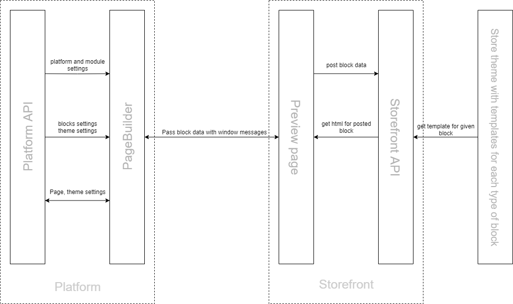
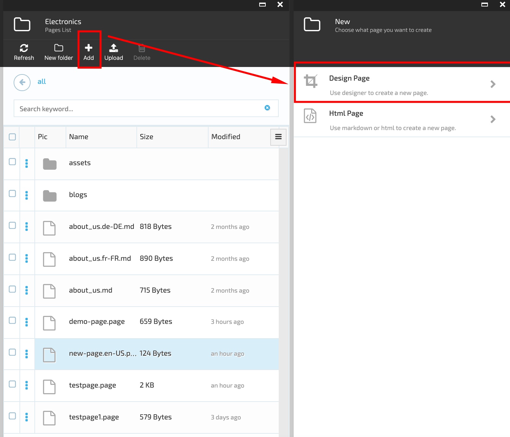
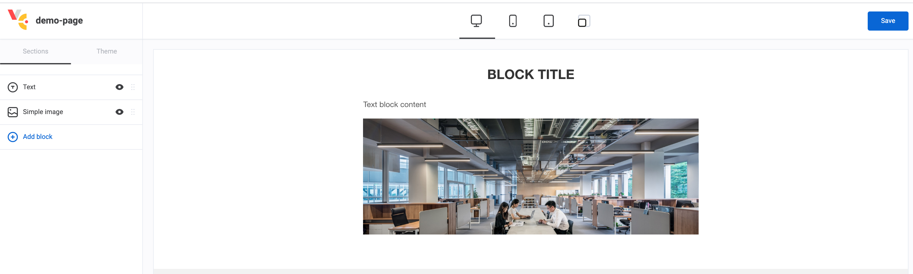
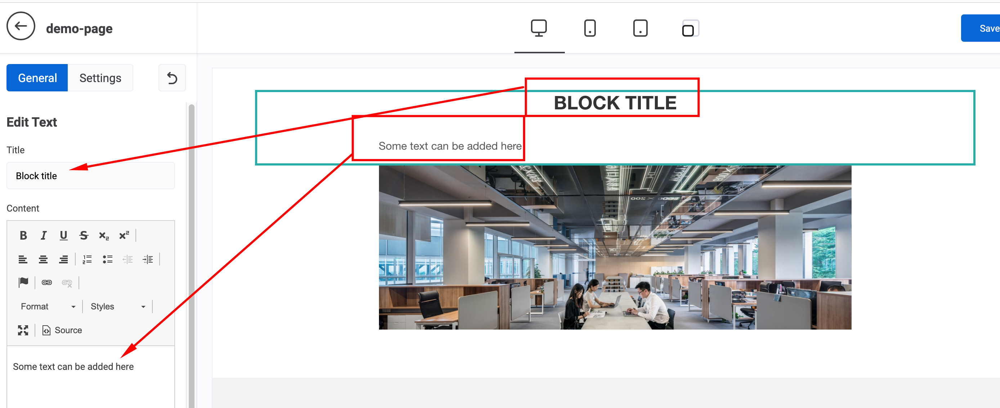
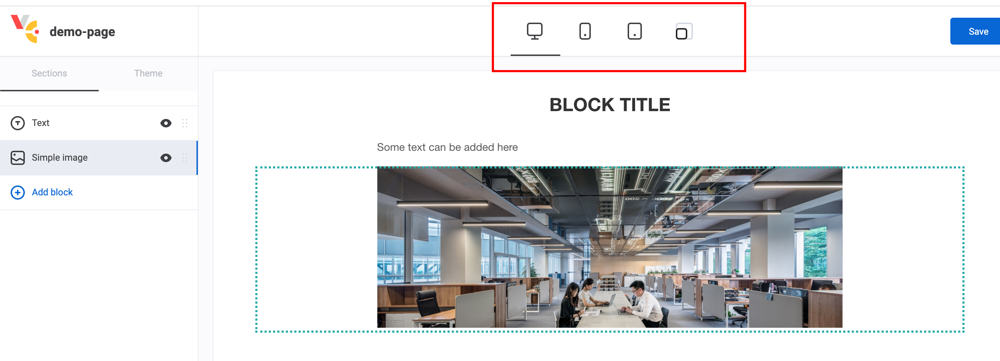
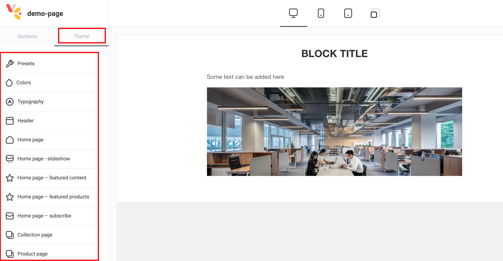
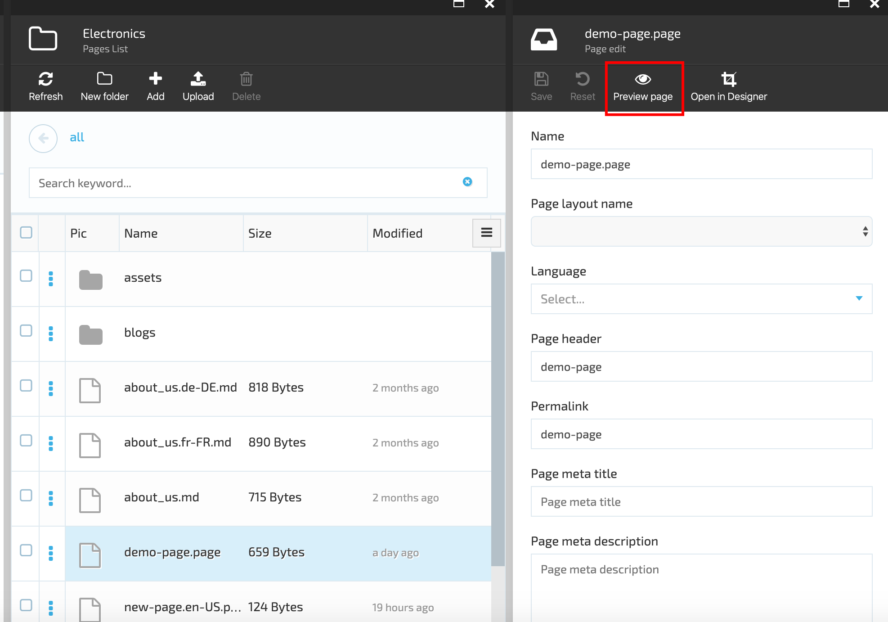
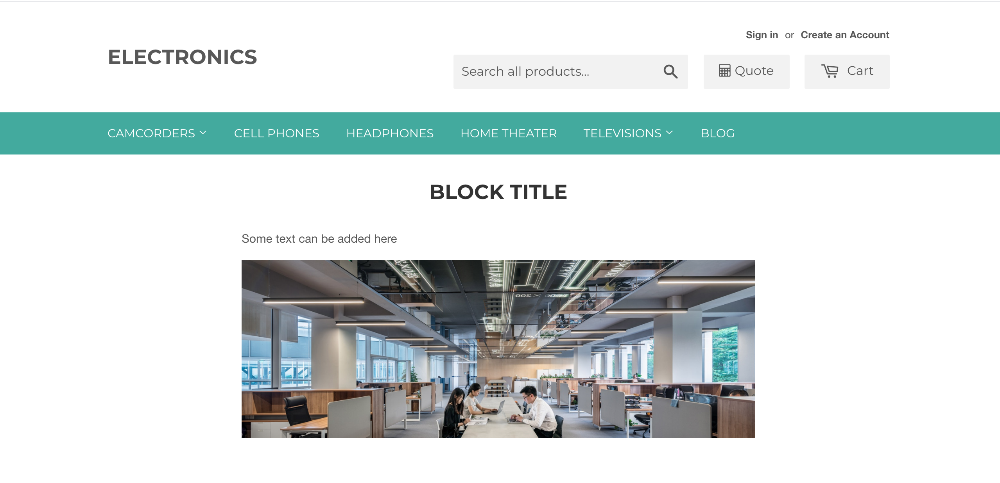
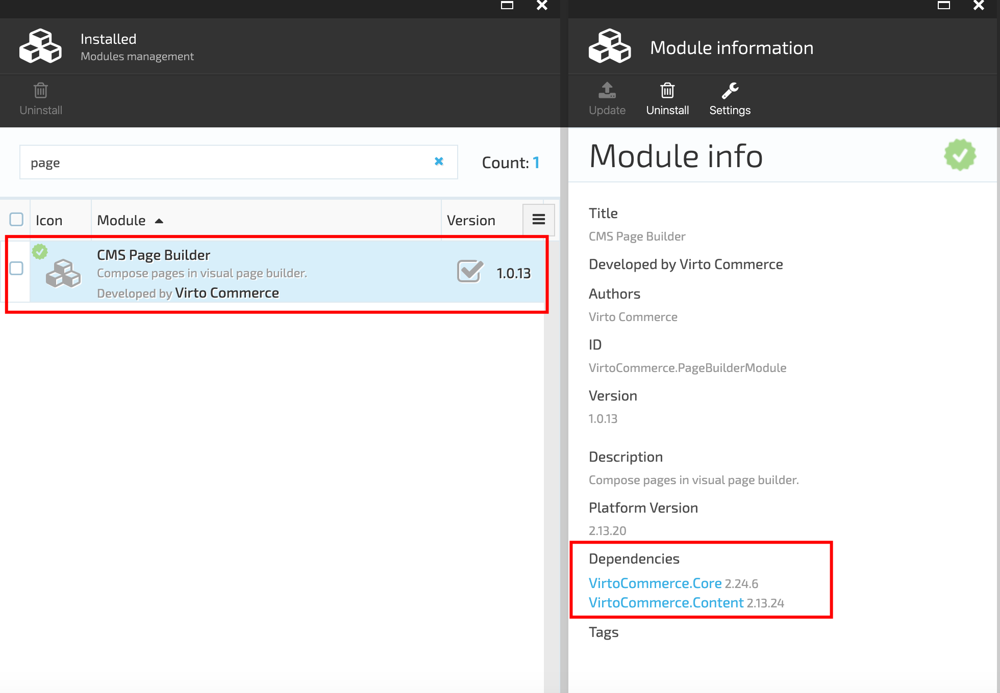

# vc-module-pagebuilder

## Overview

The Pagebuilder allows creating static pages from blocks and editing them using a visual editor.

Each page consists of several different blocks. The blocks view and settings depend on web page requirements.

The page is created in the builder as a list of blocks with specific settings applied to each block. All data are saved in a Json file format.

## Subsystem component description

The builder is consisted of two main subsystems:

1. Script with Creating logics;
1. Script with Preview visualization logics.

The Builder runs on admin side so that it can receive data from VC platform and save changes made during editing of pages and themes.

The Preview script runs on Storefront, as only Storefront 'knows' which templates should be used to generate the html.

The scripts 'communicate' with each other via messages- [`window.postMessage()`](https://developer.mozilla.org/en-US/docs/Web/API/Window/postMessage)

### Interaction of Pagebuilder Module Parts Diagram



## Pagebuilder Interface Part

### Add New Page

In order to add a new page, the user should go through the following steps:

1. Go to More > Content module > select a Store and click on Pages widget;
1. On 'Pages list' blade select 'Add' to add a new page;
1. Choose 'Design page' on the new blade;

1. Fill out the following fields to create a new page:

   1. Name- required field;
   1. Page layout name - select from drop down list (optional);
   1. Language - select from dropdown list (optional);
   1. Page header (optional);
   1. Permalink;
   1. Page metatitle (optional);
   1. Page meta description (optional)
1. Click 'Create' button;
1. The new page will be created.

### Edit Page

1. Select the page file from the list of pages;
1. Click 'Open in Designer';
1. The system opens the Pagebuilder that consists of:

   1. Editor;
   1. Preview area.
1. The Editor has two sections:

   1. Blocks;
   1. Theme.
1. In 'Blocks' section click on 'Blocks' to view the list of available blocks;

1. Clicking on the '+' icon of the selected block will result in adding the block to the file;
1. Clicking on the block in the 'Preview' area opens the block editor;

1. Once the blocs are edited, click the 'Save' button to save the changes made;
1. Click on the icons above the blocks in the 'Preview' area to view different screen resolutions;

1. Select the 'Theme' section in the Editor to edit different theme parameters.



### Add and Edit Page Demo


### Page Preview

1. Open Content module > select Store > clicks on Pages widget > select the page and click on 'Preview page' icon

1. The system will display the page in Storefront with no possibility to edit the page.


## Installation

### Install Pagebuilder module

1. Automatically: More > Modules > Available, select the CMS Page Builder module and click Install.
1. Manually: download module ZIP package from https://github.com/VirtoCommerce/vc-module-pagebuilder/releases. In VC Manager go to More > Modules > Advanced, upload module package and click Install.
1. Once the Pagebuilder module is installed, it will appear under 'Installed' modules.
1. The installed Pagebuilder module has two dependencies:

   1. Content module;
   1. Core module.



## Configuration

### Assets relative path

Relative URL in store used to preview blocks in PageBuilder

### AutoToken URL

Relative path to VC platform used to update the authorization toke.

## Builder

The builder consists of two applications: 

1. The first app is the Builder itself. The builder is located in ./cms-designer folder.
The builder is run as follows:

   1. For production:
     ```
     npm run build
     ```
    1. For development:

     ``` 

     npm run serve

     ``` 
1. The second part of the app is a script that allows page preview and starts on Storefront side. This script is located in ./store folder.

``` 
npm run build:prod
```
For debugging purposes a map file should be created.

``` 
npm run build
```

## License

Copyright (c) Virto Solutions LTD. All rights reserved.

Licensed under the Virto Commerce Open Software License (the "License"); you may not use this file except in compliance with the License. You may obtain a copy of the License at

http://virtocommerce.com/opensourcelicense

Unless required by applicable law or agreed to in writing, software distributed under the License is distributed on an "AS IS" BASIS, WITHOUT WARRANTIES OR CONDITIONS OF ANY KIND, either express or implied.